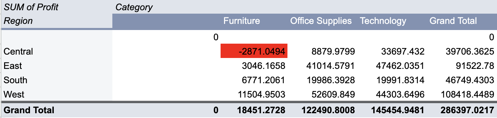

# Superstore Sales & Profit Analysis

## Overview

This project analyzes the Sample Superstore dataset to examine sales and profit performance across products, with a focus on evaluating whether the current discount strategy is effective or contributing to losses.

## Tools Used

- MySQL (database)
- TablePlus (query tool)
- SQL (aggregate functions, window functions, subqueries)

## Questions & Findings

### Q1: What is the total sales amount for each region?

```sql
SELECT Region, SUM(Sales) AS total_sales
FROM SampleSuperstore
GROUP BY Region
ORDER BY total_sales DESC;
```

| Region | Total Sales |
|---|---|
| West | $725,458 |
| East | $678,781 |
| Central | $501,240 |
| South | $391,722 |

**Finding:** The West region generates the highest sales, nearly double that of the South region, which lags significantly behind.

---

### Q2: What is the average profit per order for each customer segment?

```sql
SELECT Segment, ROUND(AVG(Profit), 2) AS avg_profit
FROM SampleSuperstore
GROUP BY Segment
ORDER BY avg_profit DESC;
```

| Segment | Avg Profit |
|---|---|
| Home Office | $33.82 |
| Corporate | $30.46 |
| Consumer | $25.84 |

**Finding:** Home Office orders are the most profitable on average, though the gap between segments is relatively small.

---

### Q3: Which sub-category has the highest sales? Which has the highest profit — are they the same?

```sql
SELECT `Sub-Category`, ROUND(SUM(Sales),2) AS total_sales, ROUND(SUM(Profit),2) AS total_profit
FROM SampleSuperstore
GROUP BY `Sub-Category`
ORDER BY total_sales DESC;
```

| Sub-Category | Total Sales | Total Profit |
|---|---|---|
| Phones | $330,007 | $44,516 |
| Chairs | $328,449 | $26,590 |
| Storage | $223,844 | $21,279 |
| **Tables** | $206,966 | **-$17,725** |
| Binders | $203,413 | $30,222 |
| Copiers | $149,528 | $55,618 |
| Bookcases | $114,880 | **-$3,473** |
| Supplies | $46,674 | **-$1,189** |

**Finding:** Sales ranking and profit ranking do not match. Tables ranks 4th in sales but has the largest loss of any sub-category — a clear sign of a problem worth investigating further.

---

### Q4: What is the profit margin (profit / sales) for each sub-category?

```sql
SELECT `Sub-Category`, 
       CONCAT(ROUND((SUM(Profit)/SUM(Sales))*100, 2), '%') AS profit_margin
FROM SampleSuperstore
GROUP BY `Sub-Category`
ORDER BY (SUM(Profit)/SUM(Sales)) DESC;
```

| Sub-Category | Profit Margin |
|---|---|
| Labels | 44.42% |
| Paper | 43.39% |
| Envelopes | 42.27% |
| Copiers | 37.2% |
| ... | ... |
| Machines | 1.79% |
| Supplies | -2.55% |
| Bookcases | -3.02% |
| **Tables** | **-8.56%** |

**Finding:** Tables has the worst profit margin of all sub-categories at -8.56%, confirming it as the most problematic product line.

---

### Q5: What is the average discount rate and profit margin for each sub-category? Do they correspond?

```sql
SELECT `Sub-Category`, ROUND(AVG(Discount),2) AS avg_discount,
       ROUND(SUM(Profit)/SUM(Sales) * 100, 2) AS profit_margin
FROM SampleSuperstore_1
GROUP BY `Sub-Category`
ORDER BY avg_discount;
```

| Sub-Category | Avg Discount | Profit Margin |
|---|---|---|
| Labels | 0.07 | 44.42% |
| Paper | 0.07 | 43.39% |
| Supplies | 0.08 | -2.55% |
| Chairs | 0.17 | 8.1% |
| Bookcases | 0.21 | -3.02% |
| **Tables** | **0.26** | **-8.56%** |
| Machines | 0.31 | 1.79% |
| **Binders** | **0.37** | **14.86%** |

**Finding:** Most sub-categories show a negative correlation between discount rate and profit margin — higher discounts tend to result in lower or negative margins (e.g., Tables, Bookcases). However, exceptions exist: Binders has the highest discount rate of all sub-categories (0.37) but remains highly profitable (14.86%), and Supplies has a low discount rate but still posts a loss. This suggests discounting alone doesn't fully explain profitability — other factors (e.g., product cost, shipping) likely play a role and would need further investigation.

---

### Q6: Within each category, which sub-category contributes the highest profit?

```sql
SELECT `Sub-Category`, Category, total_profit, rank_in_category
FROM (
    SELECT `Sub-Category`, Category, ROUND(SUM(Profit),2) AS total_profit, 
           RANK() OVER(PARTITION BY Category ORDER BY SUM(Profit) DESC) AS rank_in_category
    FROM SampleSuperstore_1
    GROUP BY `Sub-Category`, Category
) AS ranking
WHERE rank_in_category = 1;
```

| Category | Top Sub-Category | Profit |
|---|---|---|
| Furniture | Chairs | $26,590 |
| Office Supplies | Paper | $34,054 |
| Technology | Copiers | $55,618 |

**Finding:** Copiers is the single biggest profit driver across the entire store, even though it's not a top seller by volume.

---

### Q7: Which state has the highest total loss?

```sql
SELECT State, ROUND(SUM(Profit),2) AS total_profit
FROM SampleSuperstore_1
GROUP BY State
ORDER BY total_profit ASC;
```

| State | Total Profit |
|---|---|
| **Texas** | **-$25,729** |
| Ohio | -$16,971 |
| Pennsylvania | -$15,560 |
| Illinois | -$12,608 |
| North Carolina | -$7,491 |

**Finding:** Texas posts by far the largest loss of any state — over 50% larger than the second-worst (Ohio). This warrants a dedicated investigation into what's driving underperformance there specifically.

## Python Analysis

Reproduced all business questions from the SQL analysis (Q1–Q5, Q7) using Python and Pandas. A data quality check was performed before the analysis, confirming no missing values across all 9,994 rows.

All results matched the SQL queries exactly, validating the reliability of the findings. This also demonstrates that the same business question can be approached with different tools — SQL works well for querying within a database environment, while Pandas offers more flexibility for data manipulation and further modelling.

**Key Pandas operations used:** `groupby` aggregation, calculated columns, sorting, and data quality checks.

**File:** `analysis.py`

## Excel Analysis (Google Sheets)

Used a pivot table to cross-analyse Region against Category — a dimension not covered in the SQL or Python stages, where regions and categories were only examined separately, making combined performance invisible.

Conditional formatting was applied to automatically flag negative profit. This revealed that **Furniture in the Central region is the only loss-making combination (-$2,871)**, while the same category generates $11,505 in profit in the West region — indicating the issue is region-specific rather than a structural problem with the category itself.



Notably, Technology performs strongly in the Central region ($33,697), making it the region's best-performing category. This suggests a possible resource reallocation: **rather than attempting to rescue Furniture sales in Central, it may be worth reducing investment in that category locally and shifting resources towards Technology.**

**A caveat:** this analysis is based on a single static snapshot of data. It cannot distinguish between a long-term trend and a short-term fluctuation (e.g. seasonality). Supporting a decision such as reducing investment would require data across a longer time period to confirm the pattern persists.

**Excel features used:** pivot tables (including cross-dimensional analysis), percentage-of-total display, conditional formatting, VLOOKUP, and IF functions.

*Download `superstore_excel_analysis.xlsx` and open in Excel or Google Sheets to view the pivot table configuration, formulas, and conditional formatting rules.*

## Key Insight

Overall, the data suggests that aggressive discounting is eroding profitability in several sub-categories, particularly Tables and Bookcases. While some high-discount items like Binders remain profitable, this appears to be the exception rather than the rule. Combined with significant losses concentrated in a few states like Texas and Ohio, this points to a need for a more selective discount strategy — one that considers both product-level and regional profitability rather than applying discounts uniformly.

## Files in this Repo

- `queries.sql` — All SQL queries used in this analysis (Q1–Q7), with comments explaining each business question
- `analysis.py` — Python/Pandas version of the same analysis, used for cross-validation
- `superstore_excel_analysis.xlsx` — Excel workbook with pivot tables, VLOOKUP, and conditional formatting
- `README.md` — This file
